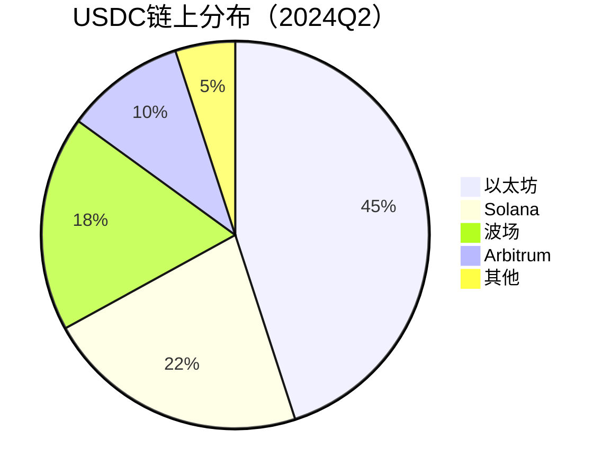

# USDC稳定币深度解析：功能、优势与使用场景  

## 什么是USDC稳定币？  

USD Coin（USDC）是一种与美元1:1锚定的加密货币，由Centre联盟发行。Centre由Circle和Coinbase等知名机构联合成立，旨在通过透明化储备机制打造安全可靠的稳定币系统。  

**核心特点**：  
- **价格稳定**：每个USDC始终对应1美元价值  
- **合规透明**：由Grant Thornton LLP每月发布储备审计报告  
- **多链兼容**：支持以太坊、Solana、Algorand等主流区块链网络  

👉 [了解如何安全持有USDC](https://bit.ly/okx_welcome)  

---

## USDC的核心功能与使用场景  

### 1. 抵御市场波动的避险工具  
在加密货币市场剧烈波动时，投资者可通过将资产转换为USDC来保护资金价值。例如比特币价格暴跌30%期间，持有USDC的投资者可避免直接损失。  

### 2. 数字资产定价基准  
主流交易所普遍采用USDC作为交易对计价单位，如ETH/USDC、BTC/USDC组合占比超过60%（CoinGecko 2024数据）。  

### 3. 跨境支付新选择  
在阿根廷、尼日利亚等通胀高企的国家，USDC转账成本较传统银行汇款降低85%，且无汇率波动风险。  

### 4. DeFi生态系统基石  
USDC占据稳定币总供应量的28%（CoinMarketCap 2024），广泛应用于：  
| 应用场景        | 典型协议                | 年化收益率* |
|-----------------|-------------------------|------------|
| 流动性挖矿      | Curve Finance           | 3-8%       |
| 质押借贷        | Aave / Compound         | 4-12%      |
| NFT交易结算     | OpenSea / Blur          | -          |

*注：收益率数据为2024年Q2平均值，实际收益可能波动  

---

## USDC与其他稳定币的差异化优势  

| 对比维度       | USDC                  | USDT                  | BUSD                |
|----------------|-----------------------|-----------------------|---------------------|
| 发行机构       | Centre（Circle主导）  | Tether Limited        | Paxos               |
| 审计频率       | 每月+每周（2024升级） | 年度（2023前）        | 每月                |
| 法律监管       | 美国SEC严格监管       | 离岸运营              | 美国NYDFS监管       |
| 储备资产       | 100%美元+美债         | 多元化资产组合        | 100%美元            |
| 市场接受度     | 交易所支持率92%       | 交易所支持率98%       | 交易所支持率65%     |

👉 [对比不同稳定币的适用场景](https://bit.ly/okx_welcome)  

---

## 常见问题解答（FAQ）  

**Q：USDC如何保证1美元的锚定价值？**  
A：通过美元储备1:1抵押机制，Circle承诺随时可赎回USDC。Grant Thornton LLP每月审计储备情况并公示。  

**Q：USDC与法币美元有何区别？**  
A：USDC具备区块链特性，支持7×24小时即时转账，且无跨境支付限制，同时保持与美元等值。  

**Q：持有USDC是否会产生费用？**  
A：存储USDC本身无管理费，但链上转账需支付网络Gas费（如以太坊平均$0.5-$2）。  

**Q：USDC会受美国货币政策影响吗？**  
A：虽然锚定美元，但USDC本身不产生利息。美联储加息可能间接提升USDC在DeFi中的借贷收益率。  

**Q：如何验证USDC储备真实性？**  
A：可访问[Circle Reserve Reports](https://www.circle.com/en/transparency)查看实时审计数据。  

---

## USDC的技术生态布局  

### 多链扩展战略  
截至2024年，USDC已支持12条区块链网络：  

### 跨链桥接解决方案  
通过Circle的Cross-Chain Transfer Protocol（CCTP），用户可在不同区块链间零信任转移USDC，较传统桥接方式降低70%手续费。  

👉 [探索USDC跨链应用场景](https://bit.ly/okx_welcome)  

---

## 监管合规与未来展望  

### 合规进展  
- 2023年通过美国《稳定币储备透明法案》首轮审查  
- 欧盟MiCA框架下获准作为"电子货币"发行  
- 中国数字人民币试点中与多家商业银行测试跨境结算  

### 市场预测  
根据Gartner 2024报告，预计到2027年：  
- USDC流通量将突破1,000亿美元  
- DeFi市场占有率提升至35%  
- 全球支付场景渗透率达12%  

---

## 安全持有USDC的三大建议  

1. **选择合规平台**：优先通过Coinbase、OKX等受监管交易所购买  
2. **分散存储**：热钱包（日常交易）与冷钱包（长期持有）比例建议7:3  
3. **定期验证**：每月查看[Circle审计报告](https://www.circle.com/en/transparency)确认储备状况  

> **重要提醒**：加密资产投资存在风险，本文不构成财务建议。请根据自身风险承受能力谨慎决策。