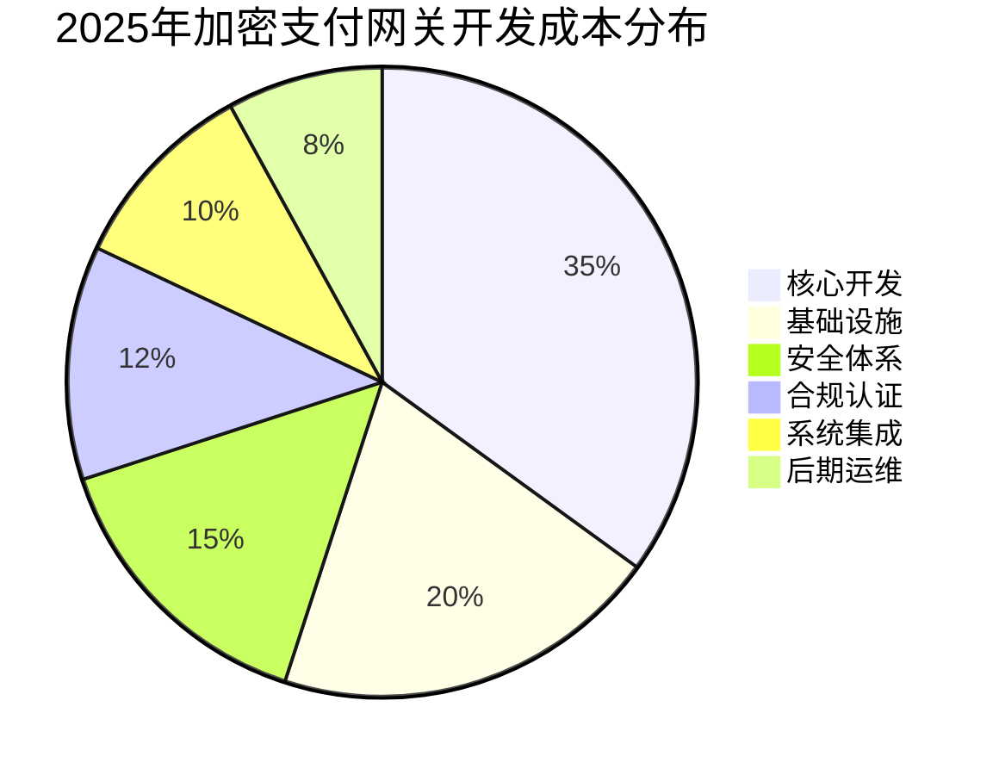
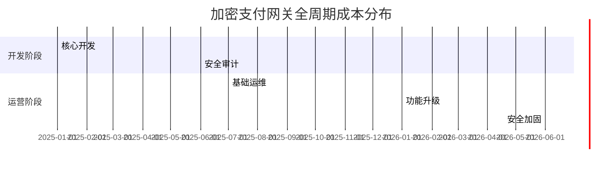

# 加密货币支付网关开发成本与优化策略全解析

## 什么是加密货币支付网关？

加密货币支付网关是通过区块链技术实现的数字化支付系统，让企业能够安全接收比特币、以太坊等主流数字货币。其核心功能包含三大模块：
1. **交易处理**：生成动态钱包地址与二维码
2. **即时兑换**：通过API对接交易所实现法币转换
3. **风险控制**：集成反欺诈系统与合规验证机制

根据运营模式可分为托管型（资金暂存平台）与非托管型（直接转入商户钱包）两种架构。这种支付方式正在改变传统金融生态，2023年全球加密支付市场规模已达**4,300亿美元**，预计2025年将突破**8,000亿美元**。

👉 [了解如何降低开发成本](https://bit.ly/okx_welcome)

## 运作流程解析

完整的加密支付交易需经历以下6个阶段：

| 阶段 | 操作流程 | 技术要点 |
|------|----------|----------|
| 1. 用户结账 | 选择加密支付选项 | 多币种支持界面设计 |
| 2. 地址生成 | 系统生成一次性钱包地址 | 防重放攻击机制 |
| 3. 支付执行 | 用户扫码完成转账 | 多签钱包技术应用 |
| 4. 链上确认 | 网络节点验证交易 | 智能确认策略配置 |
| 5. 法币转换 | 实时汇率兑换（可选） | 流动性聚合引擎 |
| 6. 交易完成 | 系统通知订单状态 | 分布式账本记录 |

区块链确认时间因网络而异：比特币平均10分钟，以太坊约15秒，Solana可实现亚秒级确认。建议采用多链聚合方案提升支付效率。

## 开发成本构成（2025年市场基准）

### 核心支出模块

1. **核心开发（35%）**  
   - 基础版（支持BTC/ETH）：￥800,000-1,200,000  
   - 企业级（多链+智能合约）：￥2,500,000-4,000,000  
   - 开发周期：基础版8-12周，企业级24-36周

2. **基础设施（20%）**  
   - 云服务（AWS/Azure）年费：￥150,000-300,000  
   - 区块链节点部署：单链￥80,000起

3. **安全体系（15%）**  
   - 多签钱包实现：￥100,000-200,000  
   - 安全审计服务：￥250,000/次

👉 [获取专业安全解决方案](https://bit.ly/okx_welcome)

### 影响成本的关键因素

| 影响维度 | 成本波动范围 | 优化建议 |
|----------|--------------|----------|
| 多链支持 | +40%-80% | 优先部署以太坊L2网络 |
| 合规认证 | +15%-35% | 采用模块化合规架构 |
| 实时兑换 | +25%-50% | 接入流动性聚合平台 |
| 用户量级 | 10万UV/月 | 弹性云架构节省30%费用 |

## 成本优化策略

### 1. MVP开发模式
- **阶段规划**：  
  - 一期（6个月）：支持BTC/ETH基础交易  
  - 二期（12个月）：增加智能合约功能  
  - 三期（18个月）：多链扩展与DeFi集成

### 2. 技术选型建议
- **开发框架**：  
  - 开源方案：BitPay Copay（节省40%成本）  
  - 企业级方案：Coinbase Commerce API
- **部署架构**：  
  采用Serverless架构可降低35%运维成本

### 3. 合规成本控制
- **区域选择**：  
  | 地区 | 合规成本指数 | 推荐方案 |
  |------|--------------|----------|
  | 新加坡 | 60 | MAS监管沙盒 |
  | 欧盟 | 100 | MiCA框架合规 |
  | 东南亚 | 45 | 分阶段申请牌照 |

👉 [获取区域合规指南](https://bit.ly/okx_welcome)

## 安全架构设计

### 五层防护体系
1. **传输层**：TLS 1.3加密协议
2. **验证层**：生物特征认证+动态验证码
3. **存储层**：冷热钱包分离（9:1比例）
4. **监控层**：AI异常交易检测
5. **应急层**：分布式熔断机制

建议每年投入安全预算的20%用于红蓝对抗演练，可将漏洞风险降低76%。

## 运维成本模型

### 全生命周期成本分布

年运维费用约占初始投资的20%-25%，建议采用DevOps自动化平台降低30%人工成本。

## 常见问题解答

**Q：如何选择支付网关的区块链底层？**  
A：优先考虑TPS（吞吐量）与Gas费平衡，Solana（5000 TPS/$.001）、Polygon（7000 TPS/$.01）是性价比优选。建议采用多链聚合架构提升扩展性。

**Q：支付确认需要多长时间？**  
A：采用智能确认策略，BTC可在1个区块确认（10分钟），ETH采用即时确认（15秒）方案，Solana实现亚秒级确认。

**Q：如何应对价格波动风险？**  
A：  
- 实时兑换：通过流动性API锁定汇率  
- 套期保值：使用Deribit进行期货对冲  
- 风险准备金：计提交易额的1.5%作为风险基金

**Q：是否需要自建区块链节点？**  
A：中小型项目建议采用Infura/Alchemy等节点即服务（NaaS），可节省70%部署成本。年交易量超50亿人民币建议自建节点。

**Q：如何实现合规KYC？**  
A：采用模块化方案：  
1. 基础KYC：身份证OCR识别（成本￥5/次）  
2. 增强KYC：生物特征+地址溯源（￥15/次）  
3. 企业KYC：法人认证+合规报告（￥500/次）

## 未来发展趋势

2025年值得关注的三大方向：
1. **ZK-Rollups技术**：将Gas费降低90%  
2. **CBDC互通协议**：实现数字货币与法币无缝转换  
3. **AI风控系统**：实时检测异常交易（准确率99.7%）
