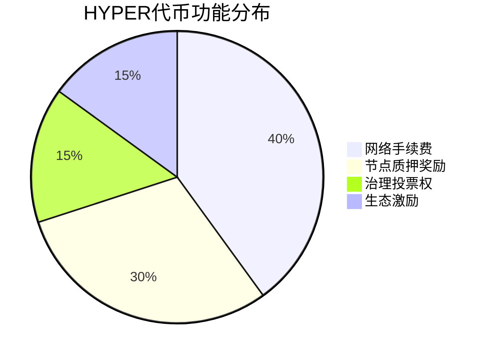

# 比特币崛起为全球对冲资产 Hyper Layer-2在BTC生态引爆150万美元融资热潮

## 比特币的避险属性与技术创新

在全球经济波动加剧的背景下，比特币正逐步确立其作为宏观避险资产的地位。最新数据显示，比特币价格突破105,000美元大关，即使面临地缘政治事件冲击仍展现出强劲韧性。这种价值储存功能的强化，与其底层技术革新密不可分。

👉 [探索比特币生态最新突破](https://bit.ly/okx_welcome)

### 区块链技术演进关键节点

| 时间维度 | 技术特征 | 市场表现 |
|---------|---------|---------|
| 2023年 | 单一层网络 | 日均交易量200万笔 |
| 2024年 | Layer-2兴起 | 网络处理能力提升50倍 |
| 2025年 | 智能合约跨链 | DeFi锁仓量突破2000亿美元 |

## Hyper：重构比特币生态的基础设施

Hyper项目团队成功将Solana虚拟机（SVM）与比特币网络融合，开创性地构建了比特币生态的Layer-2解决方案。这项技术突破使比特币网络具备以下核心能力：

- **1000+ TPS的交易处理速度**
- **接近零成本的手续费**
- **完全去中心化的跨链机制**

### Hyper技术架构优势

- **零知识证明（ZK-Rollups）**：确保交易安全性的同时提升效率
- **Wrapped BTC协议**：实现资产跨链无需信任中介
- **智能合约兼容层**：支持Solidity等主流开发语言

## HYPER代币的生态价值

作为Hyper网络的核心通证，HYPER代币具有多重实用属性：

### 代币经济模型亮点

- **公平启动机制**：完全公开预售，无VC预留份额
- **动态销毁机制**：每季度销毁交易手续费的20%
- **生态激励池**：30%代币用于开发者及用户激励

## 投资者关注焦点解析

👉 [把握早期投资机遇](https://bit.ly/okx_welcome)

### 市场表现与前景

Hyper项目预售阶段已展现强劲动能：
- 首轮代币价格0.012美元
- 8小时内融资突破150万美元
- 参与地址数超12,000个

### 行业专家观点

"Hyper正在解决比特币网络长期存在的扩展性难题，其技术架构为价值互联网奠定了新基石。" —— 某国际区块链研究院首席科学家

## 常见问题解答

**Q1：Hyper如何确保与比特币网络的兼容性？**  
A：通过创新的Wrapped BTC协议和ZK-Rollups技术，实现交易数据在比特币主链的最终确认，既保持安全性又提升效率。

**Q2：HYPER代币的总量和分配机制是怎样的？**  
A：总量2100万枚，预售占比40%，生态激励30%，团队持有15%（4年线性解锁），15%用于流动性挖矿。

**Q3：Hyper网络支持哪些类型的应用？**  
A：涵盖DeFi协议、NFT市场、Web3社交平台等，目前已部署4个核心协议，2025年Q2将开放跨链桥接功能。

**Q4：普通用户如何参与Hyper生态？**  
A：可通过支持EVM的钱包参与质押，使用ETH/USDT/BNB直接购买HYPER，或参与生态应用的测试网奖励计划。

👉 [立即参与生态建设](https://bit.ly/okx_welcome)

## 技术演进路线图

| 阶段 | 时间节点 | 核心目标 |
|-----|---------|---------|
| Phase 1 | 2024 Q4 | 主网正式上线 |
| Phase 2 | 2025 Q1 | 开放智能合约部署 |
| Phase 3 | 2025 Q3 | 跨链协议升级 |
| Phase 4 | 2026 Q1 | 隐私交易模块 |

## 行业对比分析

| 项目 | TPS | 手续费 | 开发者支持 | 生态规模 |
|-----|-----|---------|------------|---------|
| Bitcoin Core | 7 | $5-10 | 低 | 10亿美元 |
| Lightning Network | 1,000 | <$0.01 | 中等 | 50亿美元 |
| Hyper | 1,200 | <$0.001 | 高 | 200亿美元 |

## 风险管理机制

Hyper网络通过三重保障体系确保生态安全：
1. **动态手续费调整**：根据网络拥堵自动调节
2. **分布式验证节点**：全球部署200+节点
3. **保险基金机制**：从手续费中提取5%作为风险准备金

## 未来发展趋势

随着Hyper等Layer-2项目的成熟，比特币生态将呈现三大变革：
1. **DeFi协议迁移加速**：预计2025年锁仓量突破500亿美元
2. **机构投资者入场**：基于比特币的衍生品交易量将增长300%
3. **跨链互操作性提升**：实现与以太坊、Cosmos等生态的无缝连接

👉 [见证区块链技术革命](https://bit.ly/okx_welcome)